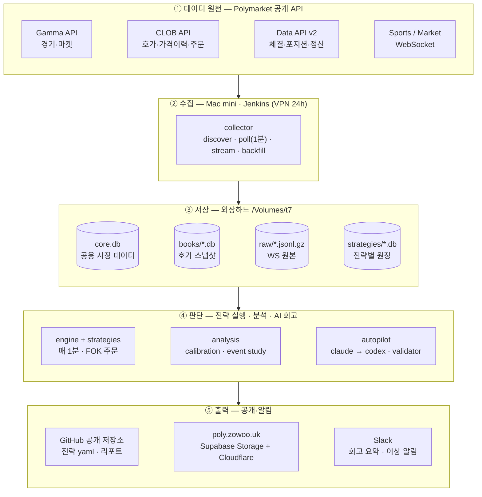
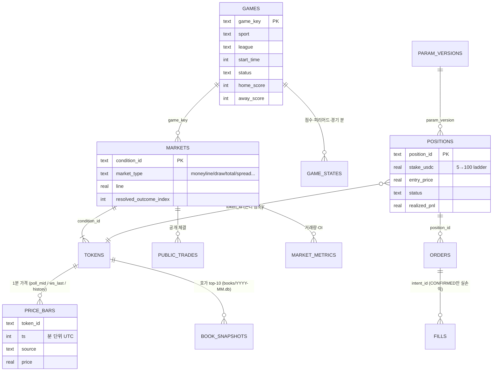
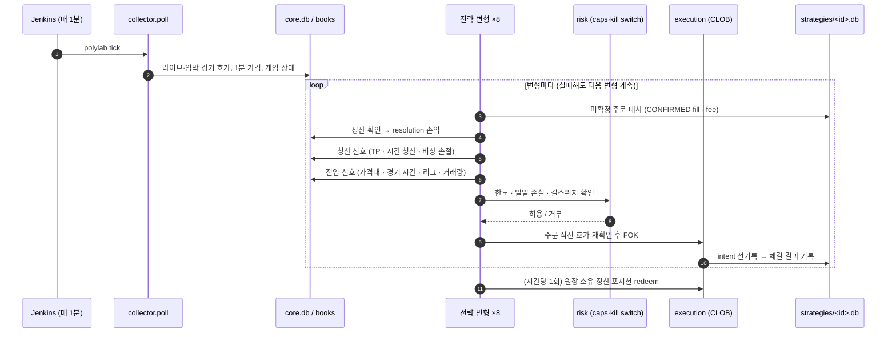
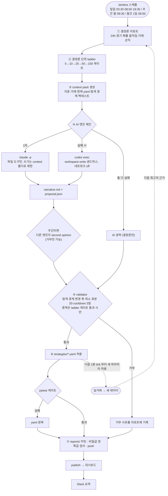
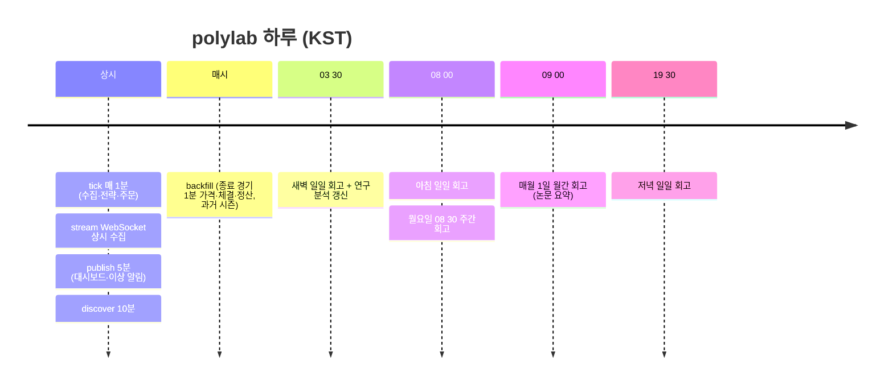
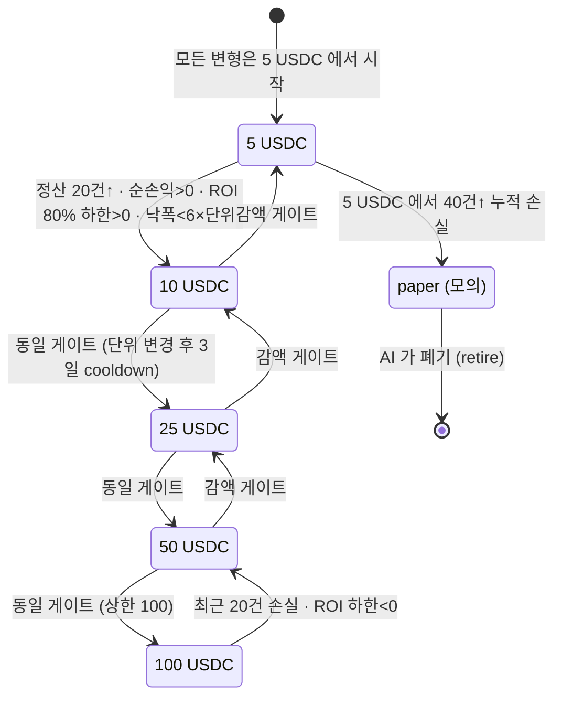
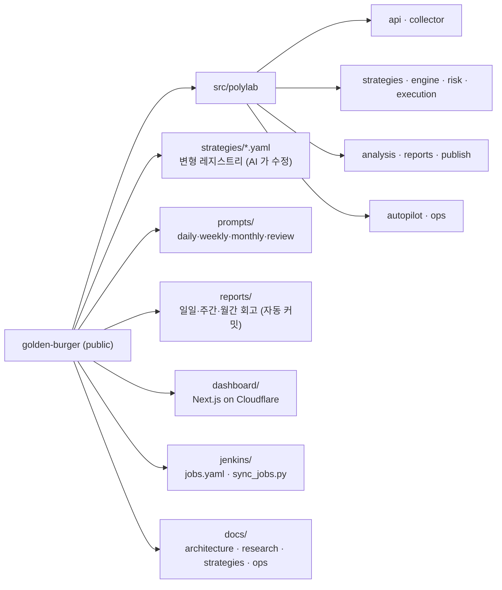

# polylab 아키텍처 (다이어그램)

논문 부록·발표용 시스템 구조도. 모든 그림은 GitHub에서 바로 렌더링되는 mermaid 로 작성했다.
텍스트 설계 명세는 [`../ARCHITECTURE.md`](../ARCHITECTURE.md), AI 자동화 상세는 [`ai-automation.md`](ai-automation.md).

## 1. 시스템 구성 (System context)

되먹임 경로(그림에서 생략): ④ 전략 엔진은 ① CLOB 에 FOK 주문을 보내고, ⑤ GitHub 에 커밋된 새 파라미터(`strategies/*.yaml`)는
5분마다 Mac mini checkout 으로 `git pull` 되어 다음 1분 tick 부터 ④에 적용된다(4번 그림).

## 2. 데이터 모델 (공용 DB + 전략별 원장)

## 3. 1분 tick (수집 → 전략 → 주문 → 대사)

## 4. AI 회고 루프 (재귀 개선)

## 5. 하루 운영 일정 (KST)

## 6. 주문 단위 ladder (논문 RQ4)

## 7. 저장소 구조

## 도구 스택

| 영역 | 도구 |
|---|---|
| 스케줄러 | Jenkins 2.461 (Mac mini, launchd), 잡 정의 코드화 `jenkins/jobs.yaml` |
| 언어·패키지 | Python 3.13, uv, pytest |
| 데이터 | SQLite(WAL) on 외장 SSD, parquet(연구 export), gzip JSONL(WebSocket 원본) |
| 시장 API | Polymarket Gamma · CLOB · Data API v2 · Sports/Market WebSocket, `py-clob-client-v2`, `polymarket-client` |
| AI | Claude Code CLI(`claude -p`, 1차), OpenAI Codex CLI(`codex exec`, 2차·검토) |
| 배포·가시화 | Supabase Storage(read model), Next.js + OpenNext on Cloudflare Workers, Slack incoming webhook |
| 형상 관리 | GitHub 공개 저장소(autopilot 은 deploy key 로 push) |
