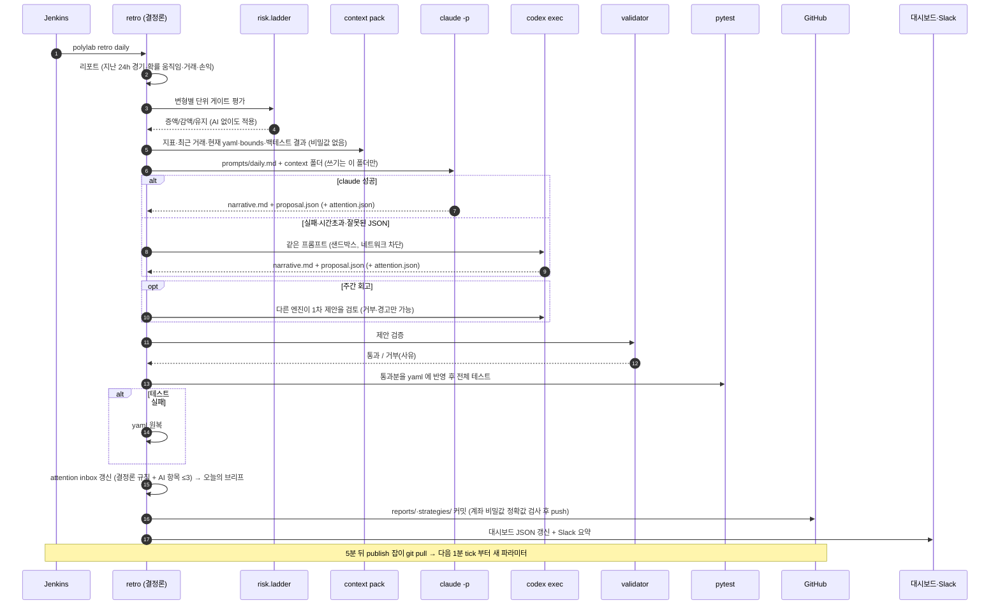

# AI 자동화 메커니즘 (autopilot)

polylab 의 "재귀 개선"은 **결정론적 뼈대 위에 AI 판단을 한 단계로 끼워 넣은 구조**다. 사람이 프롬프트를 치지 않는다.
Jenkins 가 정해진 시각에 `polylab retro <kind>` 를 실행하면, 코드가 AI 에게 줄 자료를 만들고, AI 는 제안서만 쓰며,
그 제안을 결정론 validator 와 테스트가 통과시켜야만 실거래 설정이 바뀐다. AI 가 멈춰도 시스템은 멈추지 않는다.

코드: `src/polylab/autopilot/` (retro · context · runner · validator · gitops), 프롬프트: `prompts/*.md`.

## 1. 누가 무엇을 하나

| 주체 | 하는 일 | 할 수 없는 일 |
|---|---|---|
| Jenkins (시계) | 03:30·08:00·19:30 일일, 월 08:30 주간, 1일 09:00 월간에 retro 실행. 놓친 회차는 다음 회차가 마지막 성공 시점부터 묶어서 처리 | 판단 |
| 결정론 코드 | 리포트 작성, 단위 ladder 판정·적용, context pack 생성, 검증, 테스트, 커밋, 게시, Slack | 새 가설 세우기 |
| AI (claude → codex) | context pack 을 읽고 `narrative.md`(서술 회고)와 `proposal.json`(변경 제안) 작성 | 명령 실행·네트워크·git·저장소 쓰기·실거래 설정 직접 변경 |
| validator | 제안을 규칙으로 걸러 통과분만 yaml 로 | 규칙 밖 변경 허용 |
| 사람 | 대시보드·Slack·`reports/` 확인, 필요 시 킬스위치나 yaml 직접 수정 | (선택) |

## 2. 한 번의 회고가 도는 순서



## 3. AI 에게 주는 것과 받는 것

- **입력 (context pack, `state/retro/<ts>/`)**: `MANIFEST.md`, 리포트 JSON, 변형별 성과(`metrics/*.json`), 최근 CONFIRMED 거래,
  calibration·이벤트 분석 요약, 현재 `strategies/*.yaml` 과 탐색 경계(bounds), (주간) 파라미터 grid 백테스트 결과.
  계좌는 alias 로만 나오고 키·지갑 주소는 없다. 공개용 사본은 `reports/context/latest/`.
- **지시 (prompts)**: 근거는 CONFIRMED 체결과 확인된 정산만, 표본 20건 미만이면 결론 금지, 논문 3개 질문과 연결,
  사용자 운영 철학(1분 주기라 후반 손절은 믿을 수 없음 → 진입을 엄격히, 작은 이익에서 일찍 청산).
- **출력**: `proposal.json` (`polylab.proposal/v1`)

```json
{"schema": "polylab.proposal/v1", "summary": "…",
 "changes": [{"variant_id": "watermelon-cat", "change": "params",
              "values": {"prob_min": 0.93}, "rationale": "…", "evidence": {"n": 34, "roi": 0.012}}]}
```

- **출력 (선택)**: `attention.json` — 사람이 알아야 하거나 결정할 것 최대 3개(`items`)와, 주간·월간은 논문 문장 초안
  (`thesis_sentences`, n ≥ 30·근거 파일 필수). retro 가 스키마·길이·분류를 검증하고 `slack.scrub` 으로 비밀값을 지운다.
  AI 는 `critical` 을 쓸 수 없고(`warn` 으로 낮춤) 규칙 항목을 건드릴 수 없다(id 앞에 `ai:`). 파일이 없거나 잘못되면
  AI 항목 없이 진행한다(회고는 실패하지 않음). 이미 열린 항목은 `attention_open.json` 으로 context pack 에 들어간다.

변경 종류: `params`(파라미터) · `stake`(단위 한 단계) · `mode`(live→paper/off 만) · `new_variant`(주간·월간, paper 로만) · `retire`.

## 4. 안전장치 (validator + 게이트)

| 규칙 | 값 |
|---|---|
| 파라미터 | yaml `bounds` 의 [min, max] 안, 한 번에 `max_step` 이하 |
| 최소 표본 | 현재 파라미터로 정산 20건 이상. 예외: **백테스트 근거 재조정** — retro 가 제안 값과 현재 값을 직접 재생(최근 120일, 현재 arm 진입 시각 중앙값으로 두 반기)해 제안 n ≥ 40(반기 ≥ 10), 두 반기 ROI 모두 현재 이상, MDD ≤ 현재×1.2 일 때만 허용. 한 단계 max_step 의 2배까지. 주간은 모든 변형(회당 2건 재생), 일일은 대상 경기가 있었는데 3일 이상 진입 0건인 변형만(1건). AI 가 proposal 에 적은 수치는 판정에 쓰지 않고, 근거는 `reports/changes.md` 에 기록 |
| 연구자 고정값 | `reports/decisions.md` 로 연구자가 정한 값(예: goal-over-all 청산 +0.02/−10%/0.99 보유)은 validator `OWNER_FIXED_PARAMS` 로 거부, attention 으로만 제안 |
| cooldown | 같은 변형의 파라미터·단위 변경 후 3일 |
| 단위 | ladder(5·10·25·50·100) 한 단계씩, **증액은 결정론 게이트 통과 시에만**, 감액은 항상 허용, 상한 100 |
| 모드 | AI 는 live 로 올릴 수 없음(live→paper/off, paper→off 만) |
| 신규 변형 | paper·5 USDC 로만, 기반 변형의 bounds·limits 상속 |
| 회당 변경 수 | 일일 2 · 주간 5 · 월간 4, 변형당 1건 |
| 테스트 게이트 | 적용 후 전체 pytest 실패 시 원복 |
| 공개 검사 | 커밋·대시보드 업로드 전 계좌 개인키·funder 주소 정확값 대조, 발견 시 중단 |
| AI 권한 | claude: 파일 도구만(`--permission-mode dontAsk`), 홈 디렉터리 읽기 금지 · codex: `workspace-write` 샌드박스, 네트워크 off |

## 5. 사람에게 보여 주는 산출물

논문 저자는 코드를 읽지 않고 회고만 읽는다는 전제로, 시스템이 먼저 알려 준다.

| 산출물 | 위치 | 내용 |
|---|---|---|
| 오늘의 브리프 | 모든 일일·주간·월간 리포트 맨 위, Slack 메시지 맨 위 | 3~6줄: 지난 회고 이후 live 실현손익·누적, 단위·파라미터 변경(거부 건수), 결정 필요 항목과 `attention.md` 링크, 긴급·경고 항목, 연구 하이라이트 1개(AI 연구 발견 또는 유의한 calibration gap) |
| 논문에 쓸 수 있는 문장 | 주간·월간 리포트, 브리프 바로 아래 | AI 초안으로 명시. n ≥ 30 과 근거 파일이 있는 문장만, 없으면 절 생략 |
| attention inbox | `reports/attention.md`(사람용), `reports/attention.json`(상태), 대시보드 `latest/attention.json` | 열린 항목(긴급 > 경고 > 결정 필요 > 참고, 최신 순)과 접힌 "최근 해결"(14일) |

attention 항목의 출처는 두 가지다.

- **자동 규칙 (AI 무관)**: 단위 증액·감액·모드 변경(3일간), 일일 손실 한도·킬스위치, AI 회고 실패·codex 대체·엔진 없음,
  validator 거부 요약(회고 종류별), 수집 공백·stream stale·잡 실패(`polylab health`), 품질 이벤트 24h 30건 이상·백필 실패,
  대상 경기가 있었는데 3일 이상 진입 0건인 변형(킬스위치 중엔 생략), 디스크 여유 100GB 미만, paper 변형 표본 수집 중
  (20건 도달 시 "live 전환 결정 필요"), 주간은 지난 7일 파라미터 변경 목록. 같은 id 는 한 항목으로 합쳐지고, 해당 규칙이
  평가되는 회고에서 조건이 풀리면 자동으로 "최근 해결"로 이동한다(주간 전용 항목은 일일 회고가 건드리지 않는다).
- **AI 판단**: 회당 최대 3개(가설과 반대인 데이터, 논문 한 문장감 발견, 저자에게 묻는 질문). 7일간 다시 나오지 않으면 만료.

코드: `src/polylab/autopilot/attention.py`(규칙·검증·병합·렌더), `src/polylab/reports/brief.py`(브리프).

## 6. 주기별 역할

| 회고 | AI 가 보는 것 | 할 수 있는 제안 | 추가 산출물 |
|---|---|---|---|
| 일일 (3회) | 지난 창의 경기·거래·손익, ladder 상태 | 작은 파라미터 조정, 감액·중지 | `reports/daily/*.md` |
| 주간 | 7일 성과 + 파라미터 grid 백테스트 | 파라미터·단위·신규 paper 변형·폐기, 다른 엔진의 교차 검토 | `reports/weekly/*.md` |
| 월간 | 누적 성과, 종목×경기 단계 calibration, 이벤트 민감도, 단위별 안정성 | 구조적 변경 제안 | `docs/research/monthly/YYYY-MM.md` (논문용) |

## 7. 사람이 개입하는 방법

- 전면 중지: Mac mini 에서 `touch /Volumes/t7/polylab/state/KILL` (신규 진입만 중단, 청산·대사는 계속).
- 특정 변형 중지: `strategies/<id>.yaml` 의 `mode: off` 로 커밋·push → 5분 안에 반영.
- AI 제안 외부 주입(선택): `autopilot/inbox/*.json` 에 같은 스키마로 커밋 → 다음 회고가 같은 validator 로 처리.
- 확인: https://poly.zowoo.uk (개요·24h 거래·시각화·연구·리포트), Slack `#polymarket-report`, 저장소 `reports/`·`reports/changes.md`,
  결정할 것은 `reports/attention.md`.
