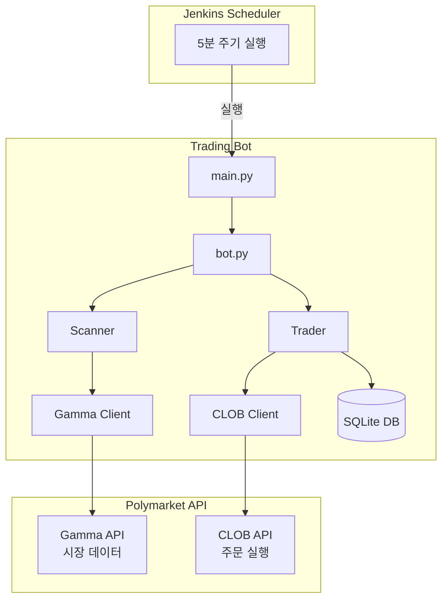
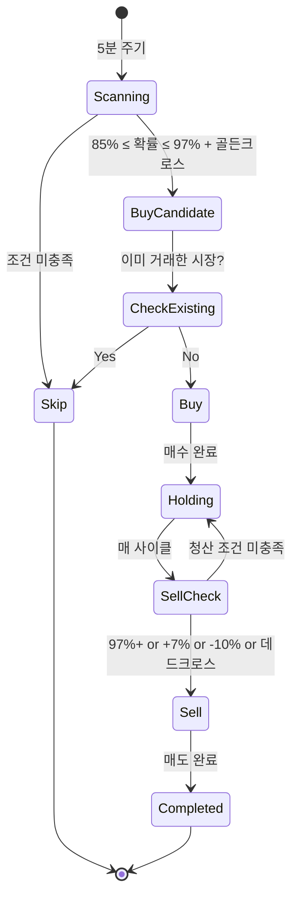

# Golden Banana - Polymarket 자동 매매 봇

모멘텀 기반 Polymarket 자동 매매 봇입니다. 예측 시장에서 85-97% 확률 구간에서 골든크로스 신호 발생 시 매수하고, 다중 청산 조건(이익실현, 손절, 데드크로스)으로 매도합니다.

## 개요

- **매수 조건**: 85% ≤ 확률 ≤ 97% + 골든크로스(15분 모멘텀 > 6시간 모멘텀)
- **매도 조건**: 확률 97%+, 진입가 대비 +7%, 데드크로스
- **손절 조건**: 진입가 대비 -10%
- **리스크 관리**: 손절, 이익실현, 모멘텀 기반 청산

## 아키텍처



## 매매 로직



## 설치

### 1. 저장소 클론

```bash
git clone https://github.com/your-repo/golden-banana.git
cd golden-banana
```

### 2. 가상환경 생성

```bash
python -m venv .venv
source .venv/bin/activate  # macOS/Linux
# or
.venv\Scripts\activate  # Windows
```

### 3. 의존성 설치

```bash
pip install -e .
```

### 4. 환경변수 설정

```bash
cp .env.example .env
```

`.env` 파일을 편집하여 API 키를 설정합니다.

## API 키 생성 방법

### 1. Private Key 확인

1. [Polymarket](https://polymarket.com) 로그인
2. [Settings > Export Private Key](https://polymarket.com/settings?tab=export-private-key) 이동
3. Private Key와 Wallet Address 복사

### 2. .env 파일 설정

```env
# Private Key (0x 접두사 포함 가능)
POLYMARKET_PRIVATE_KEY=0xYourPrivateKeyHere

# Wallet Address
POLYMARKET_FUNDER_ADDRESS=0xYourWalletAddress
```

### 3. API 연결 테스트

```bash
python scripts/test_api_key.py
```

성공 시 다음과 같이 표시됩니다:

```
==================================================
Polymarket API Connection Test
==================================================

[1] Checking environment variables...
  [O] Private Key: 0xacbb2055...cf92
  [O] Funder Address: 0x501756b6...72Fa

[2] Testing Gamma API (public)...
  [O] Market data retrieved: 1 market(s)

[3] Testing CLOB API authentication...
  [O] API Key derived: abc123...
  [O] Credentials set successfully

[4] Testing order query...
  [O] Open orders: 0

==================================================
All tests passed! API connection is working.
==================================================
```

## 사용법

### 시뮬레이션 모드 (권장: 먼저 테스트)

```bash
# 시뮬레이션 실행 (실제 거래 없음)
python scripts/simulate.py

# 또는
polybot run --simulate
```

### 실제 거래

```bash
# 기본 설정으로 실행
polybot run

# 상세 로그 출력
polybot run --verbose
```

### 상태 확인

```bash
# 현재 포지션 및 통계 확인
polybot status
```

### 설정 확인

```bash
# 현재 설정 출력
polybot config
```

## 설정

`config.yaml` 파일에서 거래 파라미터를 조절할 수 있습니다:

```yaml
trading:
  # 매수 임계값 (기본: 85%)
  buy_threshold: 0.85

  # 매도 임계값 (기본: 97%)
  sell_threshold: 0.97

  # 매수 금액 (USDC)
  buy_amount_usdc: 10.0

  # 최소 유동성 ($)
  min_liquidity: 50000

  # 이익실현 (진입가 대비 +7%)
  take_profit_percent: 0.07

  # 손절 (진입가 대비 -10%)
  stop_loss_percent: -0.10

  # 최대 동시 포지션 (-1: 무제한)
  max_positions: -1

  # 모멘텀 설정
  momentum:
    enabled: true
    short_window: 3      # 15분 (3 스냅샷 * 5분)
    long_window: 72      # 6시간 (72 스냅샷 * 5분)
    golden_cross_threshold: 0.02
    dead_cross_threshold: -0.02

  # 제외 카테고리
  excluded_categories:
    - Sports
    - NFL
    - NBA
    # ...

# 시뮬레이션 모드
simulation_mode: false
```

## Jenkins 통합

### Jenkinsfile 예시

```groovy
pipeline {
    agent any

    triggers {
        cron('*/5 * * * *')  // 5분마다 실행
    }

    environment {
        POLYMARKET_PRIVATE_KEY = credentials('polymarket-private-key')
        POLYMARKET_FUNDER_ADDRESS = credentials('polymarket-funder-address')
    }

    stages {
        stage('Run Bot') {
            steps {
                sh '''
                    cd /path/to/golden-banana
                    source .venv/bin/activate
                    polybot run --job ${JOB_NAME}
                '''
            }
        }
    }
}
```

### 다중 설정 운영

서로 다른 설정으로 여러 Job을 실행할 수 있습니다:

```bash
# 공격적 설정 (75% 매수, 85% 매도)
polybot run --config config_aggressive.yaml --job aggressive

# 보수적 설정 (85% 매수, 95% 매도)
polybot run --config config_conservative.yaml --job conservative
```

각 Job은 별도의 DB를 사용합니다: `data/{job_name}/trades.db`

## 프로젝트 구조

```
golden-banana/
├── config.yaml                 # 매매 설정
├── .env                        # API 키 (gitignore)
├── pyproject.toml              # 프로젝트 설정
│
├── src/polybot/
│   ├── main.py                 # CLI 진입점
│   ├── bot.py                  # 봇 오케스트레이터
│   ├── config.py               # 설정 로드
│   │
│   ├── api/
│   │   ├── gamma_client.py     # 시장 데이터 API
│   │   └── clob_client.py      # 주문 실행 API
│   │
│   ├── strategy/
│   │   ├── scanner.py          # 시장 스캔
│   │   ├── trader.py           # 매매 로직
│   │   └── filters.py          # 필터 함수
│   │
│   ├── db/
│   │   ├── models.py           # DB 모델
│   │   └── repository.py       # CRUD
│   │
│   └── utils/
│       ├── logger.py           # 로깅
│       └── retry.py            # 재시도 로직
│
├── scripts/
│   ├── test_api_key.py         # API 테스트
│   └── simulate.py             # 시뮬레이션
│
└── data/                       # 런타임 데이터
    └── {job_name}/
        ├── trades.db           # SQLite DB
        └── logs/               # 로그 파일
```

## 거래 규칙 상세

| 상황 | 동작 |
|------|------|
| 85% ≤ 확률 ≤ 97% + 골든크로스 | 매수 |
| 확률 97% 이상 도달 | 매도 |
| 진입가 대비 +7% 이상 | 이익실현 매도 |
| 진입가 대비 -10% 이하 | 손절 매도 |
| 데드크로스 발생 | 모멘텀 청산 |
| 골든크로스 미발생 | 대기 (매수 안함) |
| 이미 거래한 시장 | 재거래 금지 |

## 주의사항

- **보안**: `.env` 파일은 절대 git에 커밋하지 마세요
- **테스트**: 실제 거래 전 반드시 시뮬레이션 모드로 테스트하세요
- **소액 시작**: 처음에는 `buy_amount_usdc: 1`로 소액 테스트를 권장합니다
- **리스크**: 자동 매매는 손실 위험이 있습니다. 감당 가능한 금액만 투자하세요

## 라이선스

MIT License
