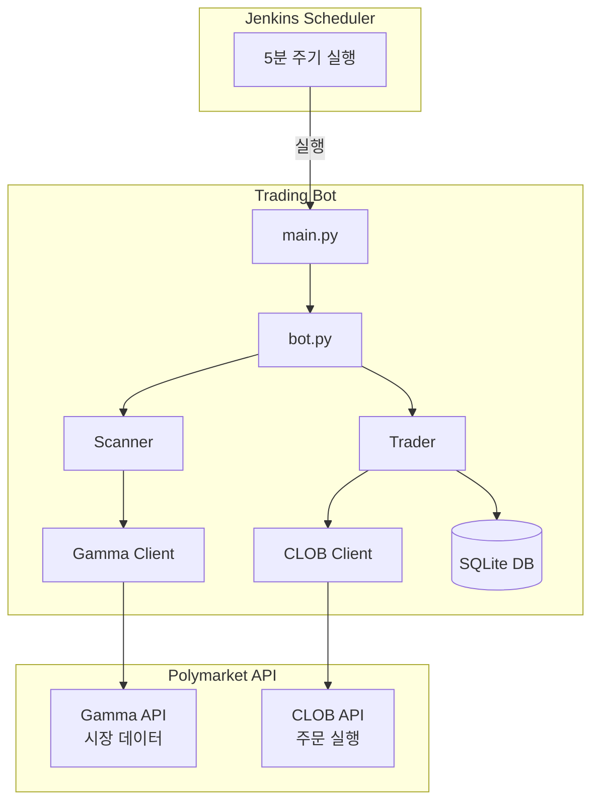
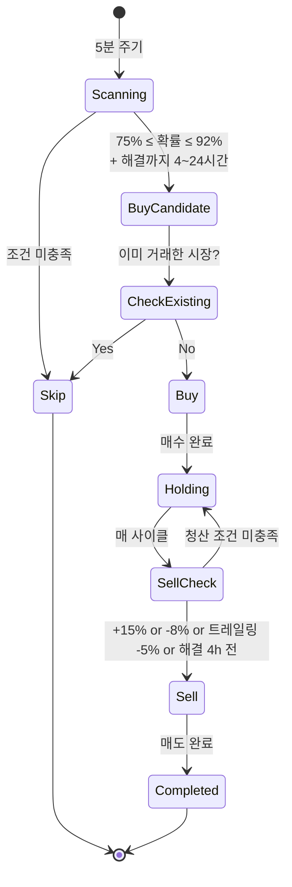

# Golden Cherry - Polymarket 자동 매매 봇

Resolution Momentum 전략 기반 Polymarket 자동 매매 봇입니다. 해결 직전(4-24시간) 고확률(75-92%) 시장에 진입하여 단기 수익을 추구합니다.

## 개요

- **매수 조건**: 75% ≤ 확률 ≤ 92% + 해결까지 4~24시간
- **매도 조건**: 익절 +15%, 손절 -8%, 트레일링 스탑 -5%, 해결 4시간 전
- **리스크 관리**: 손절, 이익실현, 트레일링 스탑, 시간 기반 청산

## 아키텍처



## 매매 로직



## 설치

### 1. 저장소 클론

```bash
git clone https://github.com/your-repo/golden-cherry.git
cd golden-cherry
```

### 2. 가상환경 생성

```bash
python -m venv .venv
source .venv/bin/activate  # macOS/Linux
# or
.venv\Scripts\activate  # Windows
```

### 3. 의존성 설치

```bash
pip install -e .
```

### 4. 환경변수 설정

```bash
cp .env.example .env
```

`.env` 파일을 편집하여 API 키를 설정합니다.

## API 키 생성 방법

### 1. Private Key 확인

1. [Polymarket](https://polymarket.com) 로그인
2. [Settings > Export Private Key](https://polymarket.com/settings?tab=export-private-key) 이동
3. Private Key와 Wallet Address 복사

### 2. .env 파일 설정

```env
# Private Key (0x 접두사 포함 가능)
POLYMARKET_PRIVATE_KEY=0xYourPrivateKeyHere

# Wallet Address
POLYMARKET_FUNDER_ADDRESS=0xYourWalletAddress
```

### 3. API 연결 테스트

```bash
python scripts/test_api_key.py
```

성공 시 다음과 같이 표시됩니다:

```
==================================================
Polymarket API Connection Test
==================================================

[1] Checking environment variables...
  [O] Private Key: 0xacbb2055...cf92
  [O] Funder Address: 0x501756b6...72Fa

[2] Testing Gamma API (public)...
  [O] Market data retrieved: 1 market(s)

[3] Testing CLOB API authentication...
  [O] API Key derived: abc123...
  [O] Credentials set successfully

[4] Testing order query...
  [O] Open orders: 0

==================================================
All tests passed! API connection is working.
==================================================
```

## 사용법

### 시뮬레이션 모드 (권장: 먼저 테스트)

```bash
# 시뮬레이션 실행 (실제 거래 없음)
python scripts/simulate.py

# 또는
polybot run --simulate
```

### 실제 거래

```bash
# 기본 설정으로 실행
polybot run

# 상세 로그 출력
polybot run --verbose
```

### 상태 확인

```bash
# 현재 포지션 및 통계 확인
polybot status
```

### 설정 확인

```bash
# 현재 설정 출력
polybot config
```

## 설정

`config.yaml` 파일에서 거래 파라미터를 조절할 수 있습니다:

```yaml
trading:
  # 매수 임계값 (기본: 75%)
  buy_threshold: 0.75

  # 매도 임계값 (기본: 92%)
  sell_threshold: 0.92

  # 매수 금액 (USDC)
  buy_amount_usdc: 5.0

  # 최소 유동성 ($)
  min_liquidity: 10000

  # 이익실현 (진입가 대비 +15%)
  take_profit_percent: 0.15

  # 손절 (진입가 대비 -8%)
  stop_loss_percent: -0.08

  # 최대 동시 포지션 (-1: 무제한)
  max_positions: -1

  # 트레일링 스탑 설정
  trailing_stop:
    enabled: true
    percent: 0.05  # 최고점 대비 -5%

  # 시간 기반 진입/청산 설정
  time_based:
    enabled: true
    entry_hours_max: 24  # 해결까지 최대 24시간
    entry_hours_min: 4   # 해결까지 최소 4시간
    exit_hours: 4        # 해결 4시간 전 청산

  # 제외 카테고리 (비어있으면 모든 카테고리 스캔)
  excluded_categories: []
    # - Sports
    # - NFL
    # - NBA

# 시뮬레이션 모드
simulation_mode: false
```

## Jenkins 통합

### Jenkinsfile 예시

```groovy
pipeline {
    agent any

    triggers {
        cron('*/5 * * * *')  // 5분마다 실행
    }

    environment {
        POLYMARKET_PRIVATE_KEY = credentials('polymarket-private-key')
        POLYMARKET_FUNDER_ADDRESS = credentials('polymarket-funder-address')
    }

    stages {
        stage('Run Bot') {
            steps {
                sh '''
                    cd /path/to/golden-cherry
                    source .venv/bin/activate
                    polybot run --job ${JOB_NAME}
                '''
            }
        }
    }
}
```

### 다중 설정 운영

서로 다른 설정으로 여러 Job을 실행할 수 있습니다:

```bash
# 공격적 설정 (75% 매수, 85% 매도)
polybot run --config config_aggressive.yaml --job aggressive

# 보수적 설정 (85% 매수, 95% 매도)
polybot run --config config_conservative.yaml --job conservative
```

각 Job은 별도의 DB를 사용합니다: `data/{job_name}/trades.db`

## 프로젝트 구조

```
golden-cherry/
├── config.yaml                 # 매매 설정
├── .env                        # API 키 (gitignore)
├── pyproject.toml              # 프로젝트 설정
│
├── src/polybot/
│   ├── main.py                 # CLI 진입점
│   ├── bot.py                  # 봇 오케스트레이터
│   ├── config.py               # 설정 로드
│   │
│   ├── api/
│   │   ├── gamma_client.py     # 시장 데이터 API
│   │   └── clob_client.py      # 주문 실행 API
│   │
│   ├── strategy/
│   │   ├── scanner.py          # 시장 스캔 (시간 기반 필터)
│   │   ├── trader.py           # 매매 로직 (트레일링 스탑)
│   │   └── filters.py          # 카테고리/유동성 필터
│   │
│   ├── db/
│   │   ├── models.py           # DB 모델
│   │   └── repository.py       # CRUD
│   │
│   └── utils/
│       ├── logger.py           # 로깅
│       └── retry.py            # 재시도 로직
│
├── scripts/
│   ├── test_api_key.py         # API 테스트
│   └── simulate.py             # 시뮬레이션
│
└── data/                       # 런타임 데이터
    └── {job_name}/
        ├── trades.db           # SQLite DB
        └── logs/               # 로그 파일
```

## 거래 규칙 상세

| 상황 | 동작 |
|------|------|
| 75% ≤ 확률 ≤ 92% + 해결 4~24시간 | 매수 |
| 진입가 대비 +15% 이상 | 이익실현 매도 |
| 진입가 대비 -8% 이하 | 손절 매도 |
| 최고점 대비 -5% 하락 | 트레일링 스탑 매도 |
| 해결까지 4시간 미만 | 시간 기반 청산 |
| 해결 24시간 초과 | 대기 (매수 안함) |
| 이미 거래한 시장 | 재거래 금지 |

---

## 전략 파라미터 레퍼런스

### 설정 우선순위

```
환경변수 > config.yaml > 코드 기본값
```

---

### 매수/매도 임계값

| 파라미터 | 환경변수 | config.yaml 키 | 코드 기본값 | 현재 config.yaml 값 | 설명 |
|---------|---------|--------------|-----------|-------------------|------|
| 매수 하한 확률 | `POLYBOT_BUY_THRESHOLD` | `trading.buy_threshold` | 0.75 | 0.75 | 이 확률 이상일 때 매수 고려 |
| 매수 상한 확률 | `POLYBOT_SELL_THRESHOLD` | `trading.sell_threshold` | 0.92 | 0.92 | 이 확률 이하일 때만 매수 (상한) |
| 매수 금액 (USDC) | `POLYBOT_BUY_AMOUNT` | `trading.buy_amount_usdc` | 5.0 | 5.0 | 건당 매수 금액 |
| 최소 유동성 | `POLYBOT_MIN_LIQUIDITY` | `trading.min_liquidity` | 50000 | 10000 | 이 금액 미만 시장 제외 |
| 최대 동시 포지션 | `POLYBOT_MAX_POSITIONS` | `trading.max_positions` | -1 (무제한) | -1 | -1이면 무제한 |

### 익절/손절

| 파라미터 | 환경변수 | config.yaml 키 | 코드 기본값 | 현재 config.yaml 값 | 설명 |
|---------|---------|--------------|-----------|-------------------|------|
| 익절 | `POLYBOT_TAKE_PROFIT` | `trading.take_profit_percent` | 0.15 | 0.15 | 진입가 대비 +15% 시 매도 |
| 손절 | `POLYBOT_STOP_LOSS` | `trading.stop_loss_percent` | -0.08 | -0.08 | 진입가 대비 -8% 시 매도 |
| 트레일링 스탑 비율 | `POLYBOT_TRAILING_STOP_PERCENT` | `trading.trailing_stop.percent` | 0.05 | 0.05 | 최고점 대비 -5% 시 매도 |

### 시간 기반 진입/청산

| 파라미터 | 환경변수 | config.yaml 키 | 코드 기본값 | 현재 config.yaml 값 | 설명 |
|---------|---------|--------------|-----------|-------------------|------|
| 진입 최대 잔여 시간 | `POLYBOT_ENTRY_HOURS_MAX` | `trading.time_based.entry_hours_max` | 24h | **720h (30일)** | 해결까지 이 시간 이내 진입 |
| 진입 최소 잔여 시간 | `POLYBOT_ENTRY_HOURS_MIN` | `trading.time_based.entry_hours_min` | 4h | **24h** | 해결까지 이 시간 이상 남아야 진입 |
| 청산 기준 잔여 시간 | `POLYBOT_EXIT_HOURS` | `trading.time_based.exit_hours` | 4h | **12h** | 해결까지 이 시간 미만이면 청산 |

> **주의**: 코드 기본값(4~24시간 단기)과 현재 config.yaml(24~720시간, 최대 30일)이 크게 다릅니다.

---

### 온/오프 가능한 모드 (Feature Flags)

| 모드 | 환경변수 | config.yaml 키 | CLI 플래그 | 현재값 | 설명 |
|-----|---------|--------------|----------|-------|------|
| 시뮬레이션 모드 | - | `simulation_mode` | `--simulate` | false | true면 실제 주문 없이 로그만 기록 |
| YES-Only 모드 | `POLYBOT_YES_ONLY` | `trading.yes_only_mode` | `--yes-only` | false | true면 index 0(Yes/1위 후보)만 매수, No 포지션 제외 |
| 트레일링 스탑 | `POLYBOT_TRAILING_STOP_ENABLED` | `trading.trailing_stop.enabled` | - | true | false면 트레일링 스탑 비활성화 |
| 시간 기반 필터 | `POLYBOT_TIME_BASED_ENABLED` | `trading.time_based.enabled` | - | true | false면 진입/청산 시간 조건 무시 |

---

### 스포츠 시장 제외 필터

**동작 방식** (`src/polybot/strategy/filters.py`):

`excluded_categories` 리스트가 비어있으면 필터링이 완전히 비활성화됩니다 (SPORTS_KEYWORDS 체크도 스킵).

비어있지 않으면 아래 3단계를 순서대로 체크합니다:

1. **태그 매칭**: 시장의 tags가 `excluded_categories`에 포함되면 제외
2. **텍스트 매칭**: 시장 question/slug에 `excluded_categories` 키워드가 포함되면 제외
3. **하드코딩 키워드 매칭**: `SPORTS_KEYWORDS` 목록에 포함되면 제외

```python
# SPORTS_KEYWORDS 목록 (filters.py 하드코딩)
리그: nba, nfl, mlb, nhl, mls, fifa, uefa, atp, wta, premier league, ...
종목: basketball, football, soccer, baseball, hockey, tennis, golf, boxing, ufc, ...
팀:   lakers, celtics, warriors, yankees, cowboys, real madrid, barcelona, ...
용어: playoff, finals, championship, tournament, match, game, win the, beat, ...
```

**현재 설정 상태**:

```yaml
# config.yaml
excluded_categories: []  # ← 빈 배열 = 스포츠 필터 완전 비활성화
```

> **⚠ 주의**: 현재 `excluded_categories: []`이므로 스포츠 시장이 필터링되지 않습니다.
> 스포츠 제외를 원하면 아래처럼 설정하세요:
>
> ```yaml
> excluded_categories:
>   - Sports
>   - sports
>   - NFL
>   - NBA
>   - MLB
>   - NHL
>   - Soccer
>   - Football
>   - Basketball
>   - Baseball
> ```

---

### 환경변수 전체 목록

```bash
# 필수 (API 인증)
POLYMARKET_PRIVATE_KEY=0xYourPrivateKey
POLYMARKET_FUNDER_ADDRESS=0xYourWalletAddress

# 매수/매도 임계값 (선택)
POLYBOT_BUY_THRESHOLD=0.75
POLYBOT_SELL_THRESHOLD=0.92
POLYBOT_BUY_AMOUNT=5.0
POLYBOT_MIN_LIQUIDITY=50000
POLYBOT_MAX_POSITIONS=-1

# 익절/손절 (선택)
POLYBOT_TAKE_PROFIT=0.15
POLYBOT_STOP_LOSS=-0.08

# 트레일링 스탑 (선택)
POLYBOT_TRAILING_STOP_ENABLED=true
POLYBOT_TRAILING_STOP_PERCENT=0.05

# 시간 기반 필터 (선택)
POLYBOT_TIME_BASED_ENABLED=true
POLYBOT_ENTRY_HOURS_MAX=720
POLYBOT_ENTRY_HOURS_MIN=24
POLYBOT_EXIT_HOURS=12

# 모드 플래그 (선택)
POLYBOT_YES_ONLY=false
```

## 데이터 분석

DB 파일 위치: `data/{job_name}/trades.db`

```bash
# SQLite 접속
sqlite3 data/{job_name}/trades.db
```

### 카테고리별 손익 분석

```sql
-- 카테고리별 거래 수 및 실현 손익
SELECT
    market_tags,
    COUNT(*) AS trades,
    ROUND(SUM(realized_pnl), 4) AS total_pnl,
    ROUND(AVG(realized_pnl), 4) AS avg_pnl
FROM trades
WHERE status = 'completed'
GROUP BY market_tags
ORDER BY total_pnl DESC;
```

### 기타 유용한 쿼리

```sql
-- 전체 실현 손익 합계
SELECT ROUND(SUM(realized_pnl), 4) AS total_pnl FROM trades WHERE status = 'completed';

-- 진입/청산 사유별 집계
SELECT entry_reason, exit_reason, COUNT(*) AS cnt, ROUND(SUM(realized_pnl), 4) AS pnl
FROM trades WHERE status = 'completed'
GROUP BY entry_reason, exit_reason
ORDER BY pnl DESC;

-- 현재 보유 포지션
SELECT question, outcome, buy_price, market_tags FROM trades WHERE status = 'holding';
```

완료된 거래는 `data/{job_name}/trades_YYYY-MM.csv` 파일에도 기록됩니다 (`market_tags` 컬럼 포함).

## 주의사항

- **보안**: `.env` 파일은 절대 git에 커밋하지 마세요
- **테스트**: 실제 거래 전 반드시 시뮬레이션 모드로 테스트하세요
- **소액 시작**: 처음에는 `buy_amount_usdc: 1`로 소액 테스트를 권장합니다
- **리스크**: 자동 매매는 손실 위험이 있습니다. 감당 가능한 금액만 투자하세요

## 라이선스

MIT License
