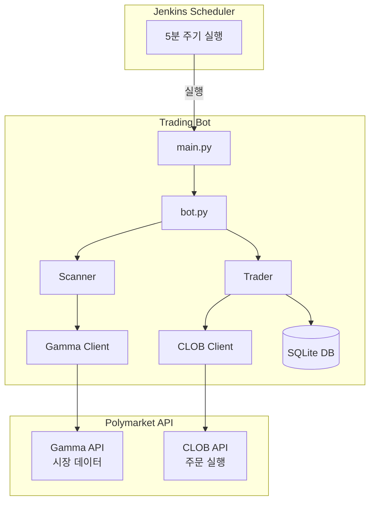
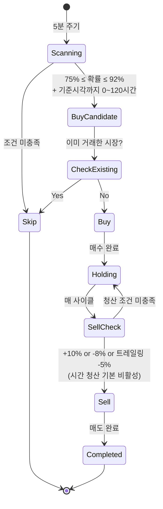

# Golden Cherry - Polymarket 자동 매매 봇

Resolution Momentum 전략 기반 Polymarket 자동 매매 봇입니다. 현재 `config.yaml`은 진입
기준시각까지 0~120시간 남은 고확률(75~92%) 시장을 대상으로 합니다. 스포츠의 기준시각은
`gameStartTime`, 그 외 시장은 `endDate`입니다.

## 개요

- **매수 조건**: 75% ≤ 확률 ≤ 92% + 기준시각까지 0~120시간
- **매도 조건**: 익절 +10%, 손절 -8%, 트레일링 스탑 -5% (시간 청산 기본 비활성)
- **리스크 관리**: 손절, 이익실현, 트레일링 스탑, 시간 기반 청산

## 아키텍처



## 매매 로직



## 설치

### 1. 저장소 클론

```bash
git clone https://github.com/your-repo/golden-cherry.git
cd golden-cherry
```

### 2. 가상환경 생성

```bash
python -m venv .venv
source .venv/bin/activate  # macOS/Linux
# or
.venv\Scripts\activate  # Windows
```

### 3. 의존성 설치

```bash
pip install -e .
```

### 4. 환경변수 설정

```bash
cp .env.example .env
```

`.env` 파일을 편집하여 API 키를 설정합니다.

## API 키 생성 방법

### 1. Private Key 확인

1. [Polymarket](https://polymarket.com) 로그인
2. [Settings > Export Private Key](https://polymarket.com/settings?tab=export-private-key) 이동
3. Private Key와 Wallet Address 복사

### 2. .env 파일 설정

```env
# Private Key (0x 접두사 포함 가능)
POLYMARKET_PRIVATE_KEY=0xYourPrivateKeyHere

# Wallet Address
POLYMARKET_FUNDER_ADDRESS=0xYourWalletAddress
```

### 3. API 연결 테스트

```bash
python scripts/test_api_key.py
```

성공 시 다음과 같이 표시됩니다:

```
==================================================
Polymarket API Connection Test
==================================================

[1] Checking environment variables...
  [O] Private Key: 0xacbb2055...cf92
  [O] Funder Address: 0x501756b6...72Fa

[2] Testing Gamma API (public)...
  [O] Market data retrieved: 1 market(s)

[3] Testing CLOB API authentication...
  [O] API Key derived: abc123...
  [O] Credentials set successfully

[4] Testing order query...
  [O] Open orders: 0

==================================================
All tests passed! API connection is working.
==================================================
```

## 사용법

### 시뮬레이션 모드 (권장: 먼저 테스트)

```bash
# 시뮬레이션 실행 (실제 거래 없음)
python scripts/simulate.py

# 또는
polybot run --simulate
```

### 실제 거래

```bash
# 기본 설정으로 실행
polybot run

# 상세 로그 출력
polybot run --verbose
```

### 상태 확인

```bash
# 현재 포지션 및 통계 확인
polybot status
```

### 설정 확인

```bash
# 현재 설정 출력
polybot config
```

## 설정

`config.yaml` 파일에서 거래 파라미터를 조절할 수 있습니다:

```yaml
trading:
  # 매수 임계값 (기본: 75%)
  buy_threshold: 0.75

  # 매도 임계값 (기본: 92%)
  sell_threshold: 0.92

  # 매수 금액 (USDC)
  buy_amount_usdc: 5.0
  max_buy_amount_usdc: 100

  # 최소 유동성 + 주문/유동성 비율 상한
  min_liquidity: 50000
  max_order_liquidity_ratio: 0.002

  # 이익실현 (진입가 대비 +15%)
  take_profit_percent: 0.15

  # 손절 (진입가 대비 -8%)
  stop_loss_percent: -0.08

  # 노출 안전한도
  max_positions: 100
  max_open_notional_usdc: 5000
  max_new_positions_per_cycle: 5

  # 트레일링 스탑 설정
  trailing_stop:
    enabled: true
    percent: 0.05  # 최고점 대비 -5%

  # 시간 기반 진입/청산 설정
  time_based:
    enabled: true
    entry_hours_max: 120 # 진입 기준시각까지 최대 5일
    entry_hours_min: 0   # 기준시각 전 모든 양수 시간
    exit_hours: 0        # endDate 기반 시간 청산 비활성화

  # 스포츠는 endDate가 아니라 gameStartTime을 진입 기준으로 사용
  game_start:
    enabled: true
    entry_buffer_minutes: 5
    reject_sports_without_game_start: true

  # 제외 카테고리 (비어있으면 모든 카테고리 스캔)
  excluded_categories: []
    # - Sports
    # - NFL
    # - NBA

# 시뮬레이션 모드
simulation_mode: false
```

## 전략 퇴역 모드

`POLYBOT_LIFECYCLE_MODE`를 설정하지 않으면 항상 `active`이며 기존 매매 로직은 그대로
실행됩니다. 전략을 퇴역시킬 때만 Jenkins 환경변수를 `close_only`로 바꿉니다.

| 값 | 기존 포지션 청산 | 신규 시장 스캔/BUY | 용도 |
|---|---:|---:|---|
| `active` | O | O | 기본 운영 |
| `close_only` | O | X | 신규 진입 동결 후 자연 청산 |
| `archive_only` | X | X | 주문 경로를 완전히 차단한 상태 점검 |

```bash
export POLYBOT_LIFECYCLE_MODE=close_only
uv run python main.py config   # Lifecycle Mode: close_only 확인
uv run python main.py run      # 기존 Jenkins의 --job 값이 있다면 동일하게 유지
```

`close_only`에서는 기존 손절·익절·트레일링 스탑·해결시간 청산과 최고가 갱신을 계속하지만
즉시 전량 매도하지는 않습니다. `market_end_date`가 없는 포지션 등은 별도 잔여 처리 대상이
될 수 있습니다. 모드 전환 전에 접수된 GTC BUY 주문은 자동 취소되지 않으므로 저장소 루트의
`tools/wind_down.py cancel --side BUY`를 dry-run한 뒤 계정별로 한 번 취소해야 합니다.
상세 절차는 [`docs/strategy-wind-down-playbook.md`](../docs/strategy-wind-down-playbook.md)를
참조하세요.

## Jenkins 통합

### Jenkinsfile 예시

```groovy
pipeline {
    agent any

    options {
        disableConcurrentBuilds()
    }

    triggers {
        cron('*/5 * * * *')  // 5분마다 실행
    }

    environment {
        POLYMARKET_PRIVATE_KEY = credentials('polymarket-private-key')
        POLYMARKET_FUNDER_ADDRESS = credentials('polymarket-funder-address')
        POLYBOT_LIFECYCLE_MODE = 'active' // 퇴역할 때만 close_only
        POLYBOT_YES_ONLY = 'true'
        POLYBOT_BUY_AMOUNT = '100'
        POLYBOT_MAX_BUY_AMOUNT_USDC = '100'
        POLYBOT_ENTRY_HOURS_MIN = '0'
        POLYBOT_ENTRY_HOURS_MAX = '120'
        POLYBOT_EXIT_HOURS = '0'
        POLYBOT_GAME_START_FILTER_ENABLED = 'true'
        POLYBOT_GAME_START_BUFFER_MINUTES = '5'
        POLYBOT_REJECT_SPORTS_WITHOUT_GAME_START = 'true'
        POLYBOT_MIN_LIQUIDITY = '50000'
        POLYBOT_MAX_ORDER_LIQUIDITY_RATIO = '0.002'
        POLYBOT_MAX_POSITIONS = '100'
        POLYBOT_MAX_OPEN_NOTIONAL_USDC = '5000'
        POLYBOT_MAX_NEW_POSITIONS_PER_CYCLE = '5'
    }

    stages {
        stage('Run Bot') {
            steps {
                sh '''
                    set +x
                    cd /path/to/golden-cherry
                    uv sync --frozen
                    uv run python main.py config
                    uv run python main.py run --yes-only
                '''
            }
        }
    }
}
```

여기서 **전략/코드 이름은 `golden-cherry`이고 자금을 보유한 운영 계좌는
`golden-banana`**입니다. Credentials Binding에는 golden-banana의 key/address를 연결하되,
디렉터리·DB·run audit의 전략명은 golden-cherry로 유지합니다. 기존 Jenkins가 `--job` 없이
실행됐다면 계속 `default` DB를 사용해야 하므로 임의로 새 `--job` 값을 붙이지 않습니다.

Freestyle Job의 Execute shell에서는 같은 환경변수를 설정한 뒤 아래 세 줄을 사용합니다.
private key와 funder address를 shell에 직접 적지 말고 Jenkins Credentials Binding으로
주입하며, secret을 참조하기 전부터 `set +x` 상태여야 합니다.

```bash
set +x
cd ./golden-cherry
/Users/jongwoopark/.local/bin/uv sync --frozen
/Users/jongwoopark/.local/bin/uv run python ./main.py config
/Users/jongwoopark/.local/bin/uv run python ./main.py run --yes-only
```

`POLYBOT_YES_ONLY=true`와 `--yes-only`는 같은 안전 모드를 가리킵니다. 둘을 함께 두면
실행 동작은 바뀌지 않으면서, 바로 앞의 `main.py config` 출력도 `YES-Only Mode: True`로
실제 run과 일치합니다.

`close_only`도 청산 조건을 5분마다 확인해야 하므로 기존 cron을 유지합니다. 단, 이전 실행이
끝나기 전에 다음 실행이 겹치지 않도록 동시 빌드를 막고, 전환 전후에 같은 `--job` 값을
사용해 기존 포지션 DB를 계속 읽어야 합니다.

### 다중 설정 운영

서로 다른 설정으로 여러 Job을 실행할 수 있습니다:

```bash
# 공격적 설정 (75% 매수, 85% 매도)
polybot run --config config_aggressive.yaml --job aggressive

# 보수적 설정 (85% 매수, 95% 매도)
polybot run --config config_conservative.yaml --job conservative
```

각 Job은 별도의 DB를 사용합니다: `data/{job_name}/trades.db`

## 프로젝트 구조

```
golden-cherry/
├── config.yaml                 # 매매 설정
├── .env                        # API 키 (gitignore)
├── pyproject.toml              # 프로젝트 설정
│
├── src/polybot/
│   ├── main.py                 # CLI 진입점
│   ├── bot.py                  # 봇 오케스트레이터
│   ├── config.py               # 설정 로드
│   │
│   ├── api/
│   │   ├── gamma_client.py     # 시장 데이터 API
│   │   └── clob_client.py      # 주문 실행 API
│   │
│   ├── strategy/
│   │   ├── scanner.py          # 시장 스캔 (시간 기반 필터)
│   │   ├── trader.py           # 매매 로직 (트레일링 스탑)
│   │   └── filters.py          # 카테고리/유동성 필터
│   │
│   ├── db/
│   │   ├── models.py           # DB 모델
│   │   └── repository.py       # CRUD
│   │
│   └── utils/
│       ├── logger.py           # 로깅
│       └── retry.py            # 재시도 로직
│
├── scripts/
│   ├── test_api_key.py         # API 테스트
│   └── simulate.py             # 시뮬레이션
│
└── data/                       # 런타임 데이터
    └── {job_name}/
        ├── trades.db           # SQLite DB
        └── logs/               # 로그 파일
```

## 거래 규칙 상세

| 상황 | 동작 |
|------|------|
| 75% ≤ 확률 ≤ 92% + 진입 기준시각 0~120시간 | 매수 후보 |
| 스포츠 | `gameStartTime`을 기준시각으로 사용; 시작 5분 전부터 신규 진입 차단 |
| 비스포츠 | `endDate`를 기준시각으로 사용 |
| 진입가 대비 +10% 이상 | 이익실현 매도 |
| 진입가 대비 -8% 이하 | 손절 매도 |
| 최고점 대비 -5% 하락 | 트레일링 스탑 매도 |
| `exit_hours=0` | endDate 기반 시간 청산 안 함 |
| 기준시각 120시간 초과 | 대기 (매수 안함) |
| 1회 주문 $100 초과 | 설정 검증 단계에서 실행 실패(fail closed) |
| 한 cycle 신규 5개 / open 원금 $5,000 / open 포지션 100개 초과 | 신규 매수 차단; 기존 청산은 계속 |
| 이미 거래한 시장 | 재거래 금지 |

---

## 전략 파라미터 레퍼런스

### 설정 우선순위

```
환경변수 > config.yaml > 코드 기본값
```

---

### 매수/매도 임계값

| 파라미터 | 환경변수 | config.yaml 키 | 코드 기본값 | 현재 config.yaml 값 | 설명 |
|---------|---------|--------------|-----------|-------------------|------|
| 매수 하한 확률 | `POLYBOT_BUY_THRESHOLD` | `trading.buy_threshold` | 0.75 | 0.75 | 이 확률 이상일 때 매수 고려 |
| 매수 상한 확률 | `POLYBOT_SELL_THRESHOLD` | `trading.sell_threshold` | 0.92 | 0.92 | 이 확률 이하일 때만 매수 (상한) |
| 매수 금액 (USDC) | `POLYBOT_BUY_AMOUNT` | `trading.buy_amount_usdc` | 5.0 | 5.0 | 건당 매수 금액 |
| 건당 하드캡 | `POLYBOT_MAX_BUY_AMOUNT_USDC` | `trading.max_buy_amount_usdc` | 100 | 100 | 주문액을 키울 때 별도로 올려야 함 |
| 최소 유동성 | `POLYBOT_MIN_LIQUIDITY` | `trading.min_liquidity` | 50000 | 50000 | 이 금액 미만 시장 제외 |
| 주문/유동성 상한 | `POLYBOT_MAX_ORDER_LIQUIDITY_RATIO` | `trading.max_order_liquidity_ratio` | 0.002 | 0.002 | 주문액은 유동성의 최대 0.2% |
| 최대 open 포지션 | `POLYBOT_MAX_POSITIONS` | `trading.max_positions` | 100 | 100 | -1/무제한은 허용하지 않음 |
| 최대 open 원금 | `POLYBOT_MAX_OPEN_NOTIONAL_USDC` | `trading.max_open_notional_usdc` | 5000 | 5000 | HOLDING/격리/대기 포지션의 요청 원금 합계 |
| cycle 신규 포지션 | `POLYBOT_MAX_NEW_POSITIONS_PER_CYCLE` | `trading.max_new_positions_per_cycle` | 5 | 5 | 3/5분 실행 한 번의 burst 제한 |

### 익절/손절

| 파라미터 | 환경변수 | config.yaml 키 | 코드 기본값 | 현재 config.yaml 값 | 설명 |
|---------|---------|--------------|-----------|-------------------|------|
| 익절 | `POLYBOT_TAKE_PROFIT` | `trading.take_profit_percent` | 0.15 | **0.10** | 진입가 대비 +10% 시 매도 |
| 손절 | `POLYBOT_STOP_LOSS` | `trading.stop_loss_percent` | -0.08 | -0.08 | 진입가 대비 -8% 시 매도 |
| 트레일링 스탑 비율 | `POLYBOT_TRAILING_STOP_PERCENT` | `trading.trailing_stop.percent` | 0.05 | 0.05 | 최고점 대비 -5% 시 매도 |

### 시간 기반 진입/청산

| 파라미터 | 환경변수 | config.yaml 키 | 코드 기본값 | 현재 config.yaml 값 | 설명 |
|---------|---------|--------------|-----------|-------------------|------|
| 진입 최대 잔여 시간 | `POLYBOT_ENTRY_HOURS_MAX` | `trading.time_based.entry_hours_max` | 120h | 120h | 기준시각까지 이 시간 이내 진입 |
| 진입 최소 잔여 시간 | `POLYBOT_ENTRY_HOURS_MIN` | `trading.time_based.entry_hours_min` | 0h | 0h | 0이면 기준시각 전 모든 양수 시간 |
| 청산 기준 잔여 시간 | `POLYBOT_EXIT_HOURS` | `trading.time_based.exit_hours` | 0h | 0h | endDate 기반 청산; 0이면 비활성화 |
| 경기시각 필터 | `POLYBOT_GAME_START_FILTER_ENABLED` | `trading.game_start.enabled` | true | true | 스포츠 진입시각을 gameStartTime으로 교체 |
| 경기 시작 buffer | `POLYBOT_GAME_START_BUFFER_MINUTES` | `trading.game_start.entry_buffer_minutes` | 5m | 5m | 시작 5분 전부터 신규 진입 차단 |
| 경기시각 누락 차단 | `POLYBOT_REJECT_SPORTS_WITHOUT_GAME_START` | `trading.game_start.reject_sports_without_game_start` | true | true | sportsMarketType만 있고 시작시각이 없으면 제외 |

#### Jenkins에서 “5일 이내 전체”로 제한

```bash
export POLYBOT_ENTRY_HOURS_MIN=0
export POLYBOT_ENTRY_HOURS_MAX=120
export POLYBOT_EXIT_HOURS=0
```

이 설정은 `0 < 진입 기준시각까지 남은 시간 <= 120시간`인 신규 시장을 대상으로 하며,
`POLYBOT_EXIT_HOURS=0`은 기존 12시간 전 자동 청산을 끕니다. 진입 최소시간만 0으로 바꾸고
청산시간을 12로 유지하면 12시간 이내 시장은 진입과 청산 조건이 충돌하므로 신규 진입에서 제외되어
“5일 이내 전체를 만기까지 보유”하려는 운영에는 맞지 않습니다. 진입 최대/최소시간은 신규
매수 필터에만 사용되므로, 이미 보유한 포지션이 120시간 밖에 있다는 이유만으로 팔리지는
않습니다. 기존 포지션에는 손절·익절·트레일링 스탑과 별도로 설정한 시간 청산만 적용됩니다.

스포츠 시장의 “5일”은 `endDate`가 아니라 `gameStartTime`까지 남은 시간입니다. 따라서 경기
종료 며칠 뒤로 잡힌 정산용 endDate 때문에 이미 시작한 경기가 뒤늦게 후보가 되는 문제를 막습니다.

### 실제 잔고 기준 매도

손절·익절·트레일링 청산은 DB의 `buy_shares`를 그대로 주문하지 않습니다.

1. CLOB의 authenticated conditional-token balance를 먼저 조회합니다.
2. `min(DB 수량, 실제 잔고)`를 6자리 소수 단위로 내려 매도합니다.
3. CLOB 거절 응답이 더 작은 잔고를 숫자로 알려주면 그 잔고보다 1 micro-share 작은 수량으로
   한 번만 재시도합니다.
4. 숫자 없는 CLOB balance-cache 오류만 99%로 한 번 재시도합니다. 5주 이상 잔여가 생기면
   trade를 `HOLDING`으로 유지해 다음 cycle에서 다시 청산합니다.

따라서 과거처럼 DB가 `9248.554900`주인데 실제 잔고가 `9248.547141`주인 작은 차이 때문에
손절 전체가 실패하지 않습니다. 5주 미만의 매도 불가능한 dust만 남은 경우에는 반복 주문을
멈추고 청산 완료로 기록합니다.

시간창과 노출 한도는 **신규 BUY만 차단**합니다. 기존 포지션을 범위 밖이라는 이유로 자동
매도하지 않습니다. 다만 배포 시 DB의 open 포지션/요청원금이 새 상한을 이미 넘었다면 기존
청산은 계속하면서 신규 BUY는 차단됩니다. 이는 데이터 정리 없이 상한을 우회하지 않기 위한
의도적인 fail-closed 동작입니다.

---

### 온/오프 가능한 모드 (Feature Flags)

| 모드 | 환경변수 | config.yaml 키 | CLI 플래그 | 현재값 | 설명 |
|-----|---------|--------------|----------|-------|------|
| 시뮬레이션 모드 | - | `simulation_mode` | `--simulate` | false | true면 실제 주문 없이 로그만 기록 |
| YES-Only 모드 | `POLYBOT_YES_ONLY` | `trading.yes_only_mode` | `--yes-only` | false | true면 index 0(Yes/1위 후보)만 매수, No 포지션 제외 |
| 트레일링 스탑 | `POLYBOT_TRAILING_STOP_ENABLED` | `trading.trailing_stop.enabled` | - | true | false면 트레일링 스탑 비활성화 |
| 시간 기반 필터 | `POLYBOT_TIME_BASED_ENABLED` | `trading.time_based.enabled` | - | true | false면 진입/청산 시간 조건 무시 |
| 경기 시작 필터 | `POLYBOT_GAME_START_FILTER_ENABLED` | `trading.game_start.enabled` | - | true | 스포츠만 gameStartTime 기준과 시작 buffer 적용 |

---

### 스포츠 시장 제외 필터

`game_start` 필터와 `excluded_categories`는 서로 다른 기능입니다. 전자는 스포츠를 거래하되
실제 경기 시작시각을 안전하게 적용하며, 후자는 스포츠 자체를 전부 제외할 때 사용합니다.
현재 `excluded_categories: []`이므로 스포츠를 허용하고 `game_start` 안전장치를 적용합니다.

**동작 방식** (`src/polybot/strategy/filters.py`):

`excluded_categories` 리스트가 비어있으면 필터링이 완전히 비활성화됩니다 (SPORTS_KEYWORDS 체크도 스킵).

비어있지 않으면 아래 3단계를 순서대로 체크합니다:

1. **태그 매칭**: 시장의 tags가 `excluded_categories`에 포함되면 제외
2. **텍스트 매칭**: 시장 question/slug에 `excluded_categories` 키워드가 포함되면 제외
3. **하드코딩 키워드 매칭**: `SPORTS_KEYWORDS` 목록에 포함되면 제외

```python
# SPORTS_KEYWORDS 목록 (filters.py 하드코딩)
리그: nba, nfl, mlb, nhl, mls, fifa, uefa, atp, wta, premier league, ...
종목: basketball, football, soccer, baseball, hockey, tennis, golf, boxing, ufc, ...
팀:   lakers, celtics, warriors, yankees, cowboys, real madrid, barcelona, ...
용어: playoff, finals, championship, tournament, match, game, win the, beat, ...
```

**현재 설정 상태**:

```yaml
# config.yaml
excluded_categories: []  # ← 빈 배열 = 스포츠 필터 완전 비활성화
```

> **⚠ 주의**: 현재 `excluded_categories: []`이므로 스포츠 시장이 필터링되지 않습니다.
> 스포츠 제외를 원하면 아래처럼 설정하세요:
>
> ```yaml
> excluded_categories:
>   - Sports
>   - sports
>   - NFL
>   - NBA
>   - MLB
>   - NHL
>   - Soccer
>   - Football
>   - Basketball
>   - Baseball
> ```

---

### 환경변수 전체 목록

```bash
# 필수 (API 인증)
POLYMARKET_PRIVATE_KEY=0xYourPrivateKey
POLYMARKET_FUNDER_ADDRESS=0xYourWalletAddress

# 매수/매도 임계값 (선택)
POLYBOT_BUY_THRESHOLD=0.75
POLYBOT_SELL_THRESHOLD=0.92
POLYBOT_BUY_AMOUNT=5.0
POLYBOT_MAX_BUY_AMOUNT_USDC=100
POLYBOT_MIN_LIQUIDITY=50000
POLYBOT_MAX_ORDER_LIQUIDITY_RATIO=0.002
POLYBOT_MAX_POSITIONS=100
POLYBOT_MAX_OPEN_NOTIONAL_USDC=5000
POLYBOT_MAX_NEW_POSITIONS_PER_CYCLE=5

# 익절/손절 (선택)
POLYBOT_TAKE_PROFIT=0.15
POLYBOT_STOP_LOSS=-0.08

# 트레일링 스탑 (선택)
POLYBOT_TRAILING_STOP_ENABLED=true
POLYBOT_TRAILING_STOP_PERCENT=0.05

# 시간 기반 필터 (선택)
POLYBOT_TIME_BASED_ENABLED=true
POLYBOT_ENTRY_HOURS_MAX=120
POLYBOT_ENTRY_HOURS_MIN=0
POLYBOT_EXIT_HOURS=0

# 스포츠 gameStartTime 필터 (선택)
POLYBOT_GAME_START_FILTER_ENABLED=true
POLYBOT_GAME_START_BUFFER_MINUTES=5
POLYBOT_REJECT_SPORTS_WITHOUT_GAME_START=true

# 모드 플래그 (선택)
POLYBOT_YES_ONLY=false
```

## 데이터 분석

DB 파일 위치: `data/{job_name}/trades.db`

```bash
# SQLite 접속
sqlite3 data/{job_name}/trades.db
```

### 카테고리별 손익 분석

```sql
-- 카테고리별 거래 수 및 실현 손익
SELECT
    market_tags,
    COUNT(*) AS trades,
    ROUND(SUM(realized_pnl), 4) AS total_pnl,
    ROUND(AVG(realized_pnl), 4) AS avg_pnl
FROM trades
WHERE status = 'completed'
GROUP BY market_tags
ORDER BY total_pnl DESC;
```

### 기타 유용한 쿼리

```sql
-- 전체 실현 손익 합계
SELECT ROUND(SUM(realized_pnl), 4) AS total_pnl FROM trades WHERE status = 'completed';

-- 진입/청산 사유별 집계
SELECT entry_reason, exit_reason, COUNT(*) AS cnt, ROUND(SUM(realized_pnl), 4) AS pnl
FROM trades WHERE status = 'completed'
GROUP BY entry_reason, exit_reason
ORDER BY pnl DESC;

-- 현재 보유 포지션
SELECT question, outcome, buy_price, market_tags FROM trades WHERE status = 'holding';
```

완료된 거래는 `data/{job_name}/trades_YYYY-MM.csv` 파일에도 기록됩니다 (`market_tags` 컬럼 포함).

## 주의사항

- **보안**: `.env` 파일은 절대 git에 커밋하지 마세요
- **테스트**: 실제 거래 전 반드시 시뮬레이션 모드로 테스트하세요
- **소액 시작**: 처음에는 `buy_amount_usdc: 1`로 소액 테스트를 권장합니다
- **리스크**: 자동 매매는 손실 위험이 있습니다. 감당 가능한 금액만 투자하세요

## 라이선스

MIT License
